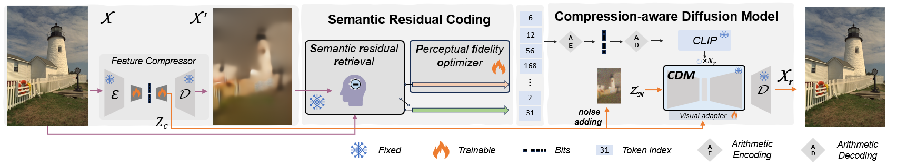
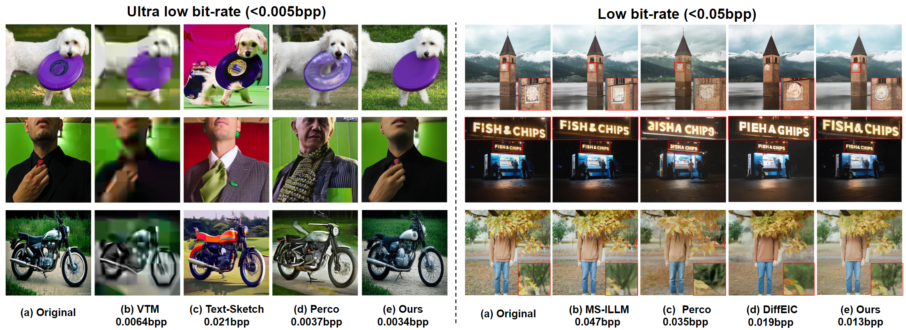

## Ultra Lowrate Image Compression with Semantic Residual Coding and Compression-aware Diffusion


<p align="center">
    <br>
</p>

## :book: Table Of Contents
- [✨ Visual Results](#visual_results)
- [⏳ Train](#computer-train)
- [😀 Inference](#inference)
- [🌊 TODO](#todo)
- [❤ Acknowledgement](#acknowledgement)
- [🙇‍ Citation](#cite)


## ⚙️ Environment Setup

```bash
- conda create -n ResULIC python=3.10
- conda activate ResULIC
- pip install -r requirements.txt
```

## <a name="Visual Results"></a>✨ Visual Results
<p align="center">
    <br>
</p>

## <a name="train"></a>⏳ Train

#### Stage 1: Initial Training

1. **Download Pretrained Model**  
   Download the pretrained **Stable Diffusion v2.1** model into the `./weight` directory:
   ```bash
   wget https://huggingface.co/stabilityai/stable-diffusion-2-1-base/resolve/main/v2-1_512-ema-pruned.ckpt --no-check-certificate -P ./weight

2. **Modify the configuration file**`./configs/train_zc_eps.yaml` and `./configs/model/cldm_eps/xx.yaml` accordingly.

3. Start training.
   ```
   bash train.sh 
   ```
#### Stage 2: 

1. Modify the configuration file `./configs/train_stage2.yaml` and `./configs/model/stage2/xx.yaml` accordingly.

2. Start training.
   ```
   bash stage2.py 
   ```

## <a name="inference"></a>😀 Inference
 
<!-- 2. Download the pre-trained weights .

-->
   
1. W/o Srr, W/o Pfo.

   ```
   CUDA_VISIBLE_DEVICES=2 python inference_win.py \
    --ckpt xx \
    --config /xx/xx.yaml \
    --output xx/ \
    --ddim_steps x \
    --ddim_eta 0 \
    --Q x.0 \
    --add_steps x00
   ```

2. W/ Srr, W/o Pfo.
   ```
    CUDA_VISIBLE_DEVICES=2 python inference_res.py \
    --ckpt xx \
    --config /xx/xx.yaml \
    --output xx/ \
    --ddim_steps x \
    --ddim_eta 0 \
    --Q x.0 \
    --add_steps x00
    ```

3. W/ Srr, W/ Pfo.
   ```
    CUDA_VISIBLE_DEVICES=2 python inference_zc.py \
    --ckpt xx \
    --config /xx/xx.yaml \
    --output xx/ \
    --ddim_steps x \
    --ddim_eta 0 \
    --Q x.0 \
    --add_steps x00
    ```

## <a name="todo"></a>🌊 TODO
- [√] Release code
- [x] Release pretrained models (Coming soon)

## <a name="acknowledgement">❤ Acknowledgement
This work is based on [ControlNet](https://github.com/lllyasviel/ControlNet), [ControlNet-XS](https://github.com/vislearn/ControlNet-XS), [DiffEIC](https://github.com/huai-chang/DiffEIC), and [ELIC](https://github.com/JiangWeibeta/ELIC), thanks to their invaluable contributions.

## <a name="cite"></a>🙇‍ Citation


